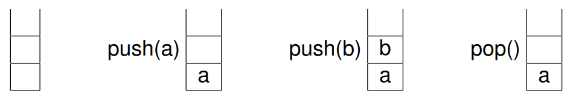

# Informações

Uma pilha é uma estrutura de dados que segue o princípio LIFO (Last In, First Out), ou seja, o último elemento inserido é o primeiro a ser removido. Imagine uma pilha de pratos: o último prato colocado por cima é o primeiro a ser retirado.

# Uso

As principais operações em uma pilha são:

- **Empilhar (push):** Insere um elemento no topo da pilha.
- **Desempilhar (pop):** Remove o elemento do topo da pilha.
- **Espiar (peek):** Retorna o elemento do topo da pilha sem removê-lo.
- **Verificar se está vazia (isEmpty):** Verifica se a pilha está vazia.

# Para que serve

As pilhas são usadas em diversas aplicações, como:

- **Navegação na web:** As pilhas são usadas para armazenar o histórico de páginas visitadas em um navegador web.
- **Desfazer/Refazer:** As pilhas são usadas para implementar os comandos "desfazer" e "refazer" em editores de texto e outros programas.
- **Avaliação de expressões:** As pilhas são usadas para avaliar expressões matemáticas e lógicas.
- **Compiladores:** As pilhas são usadas para armazenar código intermediário durante a compilação de programas.

# Vantagens

- **Eficiência:** As operações em pilhas são geralmente muito eficientes, pois o acesso aos elementos é sempre feito no topo da pilha.
- **Simplicidade:** A implementação de uma pilha é relativamente simples.

# Desvantagens

- **Acesso aleatório lento:** Acessar um elemento específico no meio da pilha pode ser lento, pois é necessário desempilhar todos os elementos acima dele.

# Exemplos de implementação

- **Lista encadeada:** Uma lista encadeada é uma forma comum de implementar uma pilha.
- **Vetor:** Um vetor também pode ser usado para implementar uma pilha, mas pode ser menos eficiente em termos de memória.